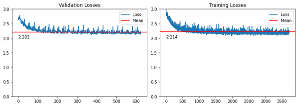
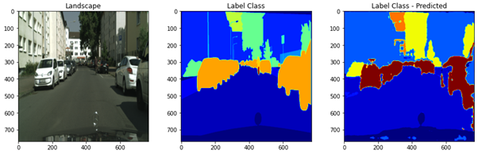

# Semantic Segmentation on Cityscapes dataset

In this project, I have trained 4 different networks for road segmentation, and then I have used the best network for detecting an unexpected obstacle on the road.
i have used ```U-Net```, ```SegNet``` and ```DeepLabV3``` for the segmentation part of my project.
Now I will show the architecture, training results, losses and outputs of each network and I will compare their results.

## Dataset
I have used the ```Cityscapes``` Dataset for training. I decreased the number of classes from 34 to 20. you can download my dataset from [here](https://drive.google.com/drive/folders/1WgF9UVW1UBMuE_tg3RNwZXp3vVoagNDK?usp=share_link). 
Here is a sample of an image and its corresponding mask:


The classes of our dataset are:

<table>
<thead>
	<tr>
		<th>Class name</th>
		<th>Corresponding Number</th>
	</tr>
</thead>
<tbody>
	<tr>
		<td>void</td>
		<td>0</td>
	</tr>
	<tr>
		<td>ego vehicle</td>
		<td>1</td>
	</tr>
    <tr>
		<td>rectification border</td>
		<td>2</td>
    <tr>
		<td>out of roi</td>
		<td>3</td>
	</tr>
    <tr>
		<td>static</td>
		<td>4</td>
	</tr>
    <tr>
		<td>dynamic</td>
		<td>5</td>
	</tr>
    <tr>
		<td>ground</td>
		<td>6</td>
	</tr>
    <tr>
		<td>road</td>
		<td>7</td>
	</tr>
    <tr>
		<td>sidewalk</td>
		<td>8</td>
	</tr>
    <tr>
		<td>parking</td>
		<td>9</td>
	</tr>
    <tr>
		<td>rail track</td>
		<td>10</td>
	</tr>
    <tr>
		<td>building</td>
		<td>11</td>
	</tr>
    <tr>
		<td>wall</td>
		<td>12</td>
	</tr>
    <tr>
		<td>fence</td>
		<td>13</td>
	</tr>
    <tr>
		<td>guard rail</td>
		<td>14</td>
	</tr>
    <tr>
		<td>bridge</td>
		<td>15</td>
	</tr>
    <tr>
		<td>tunnel</td>
		<td>16</td>
	</tr>
    <tr>
		<td>pole</td>
		<td>17</td>
	</tr>
    <tr>
		<td>polegroup</td>
		<td>18</td>
	</tr>
    <tr>
		<td>traffic light </td>
		<td>19</td>
	</tr>


</tbody>
</table>

## U-Net
The architecture that has been considered for ```U-Net``` in the project is as below:


the results of training ```U-Net``` are as below. the validation and training figures are as below:

 

and the ```IoU``` Changes figure is as below:


I gave an image as input to see the the output and there is the result:



as you can see, the ```U-Net``` model has not detected the edges of different classes very good.

## SegNet
The architecture that has been considered for ```SegNet``` is as below.


as ypu know, ```SegNet``` has less trainable parameter than ```U-Net``` because of using ```UpSampling``` instead of ```Transposed Convolution``` which has trainable parameters.

the results of training ```SegNet``` are as below. the validation and training figures are as below:

 

and the ```IoU``` Changes figure is as below:


I gave an image as input to see the the output and there is the result:


The output of this model is almost same as previous results.


## DeepLabV3
In this project, I used 2 different versions of ```DeepLabV3``` are used which are ```DeeLabV3``` with backbone of ```ResNet_50``` Network and ```DeeLabV3``` with backbone of ```ResNet_101```.

### DeepLabV3_ResNet_50


the results of training ```DeepLabV3_ResNet_50``` are as below. the validation and training figures are as below:

 

and the ```IoU``` Changes figure is as below:


I gave an image as input to see the the output and there is the result:


as you can see the model has had an excellent output specially on edges.

### DeepLabV3_ResNet_101


the results of training ```DeepLabV3_ResNet_101``` are as below. the validation and training figures are as below:

 

and the ```IoU``` Changes figure is as below:


I gave an image as input to see the the output and there is the result:


## Results 

In this table we can compare the final results of training each model:

<table>
<thead>
	<tr>
		<th>Network</th>
		<th>epochs</th>
        <th>Batch Size</th>
        <th>Image Size</th>
        <th>Mean mIoU</th>
        <th>Best mIoU</th>
        <th>Val loss</th>
        <th>Number of Parameters</th>
	</tr>
</thead>
<tbody>
	<tr>
		<td>U-Net</td>
		<td>50</td>
        <td>4</td>
        <td>768x768</td>
        <td>0.57</td>
        <td>0.75</td>
        <td>2.202</td>
        <td>31.4 M</td>
	</tr>
	<tr>
		<td>SeNet</td>
        <td>50</td>
        <td>4</td>
        <td>650x650</td>
        <td>0.52</td>
        <td>0.72</td>
        <td>0.625</td>
        <td>29.44 M</td>
	</tr>
    <tr>
		<td>DeepLabV3_ResNet_50</td>
        <td>50</td>
        <td>4</td>
        <td>650x650</td>
        <td>0.67</td>
        <td>0.82</td>
        <td>0.33</td>
        <td>42 M</td>
    <tr>
		<td>DeepLabV3_ResNet_101</td>
        <td>50</td>
        <td>4</td>
        <td>650x650</td>
        <td>0.67</td>
        <td>0.84</td>
        <td>0.34</td>
        <td>60.99 M</td>
	</tr>


</tbody>
</table>

According to the above results, I think ```DeepLabV3_ResNet_50``` is the best choice among these four networks, because of that we have to take into account the ```Number of Trainable Parameters``` for hardware implementation part.


# Detecting Unexpected Obstacles on the road

In the next part of the project, I Used the ```DeepLabV3_ResNet_50``` for detecting Unexpected Obstacles on the road.
 In order to do that, first we have to give an image containing an Unexpected obstacle. I used [Fishyscapes](https://fishyscapes.com/dataset) Dataset.

 here is a sample of the dataset:

 

 first we give the image to our model and then the model will predict a probability and a class number. For Detecting the unexpected obstacle, we have to find out which part of the input has the lowest logits, because the lowest logit means there might be a disturbance in that part of the image.
 here is the result of the prediction of logits for each class :

 

 now by calculating ```argmax``` and ```max``` of each class, we will make following tensors:

$$L_(h,w) = max F_(c,h,w) $$

$$Y_(h,w) = argmax F_(c,h,w) $$

Now by normalizing ```L``` tensor and plotting it we will see following picture:


You can see that the unexpected obstacle is highlighted. However you can give the ```SML``` image to a ```U-Net``` to make a more specific detection. 